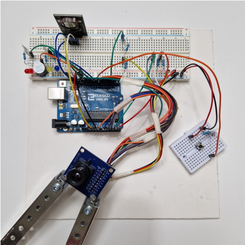
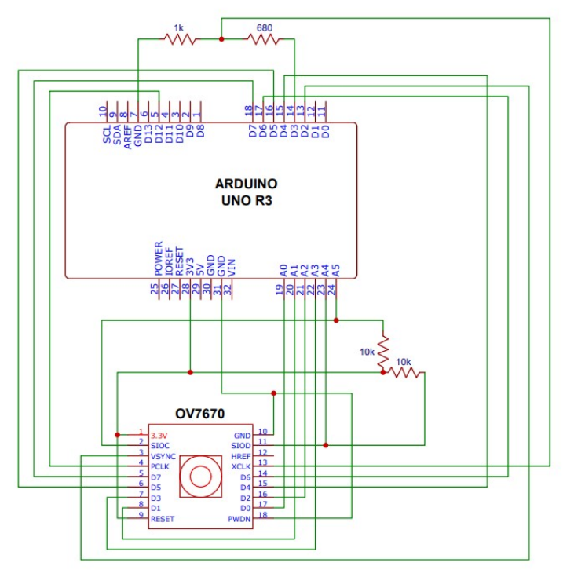
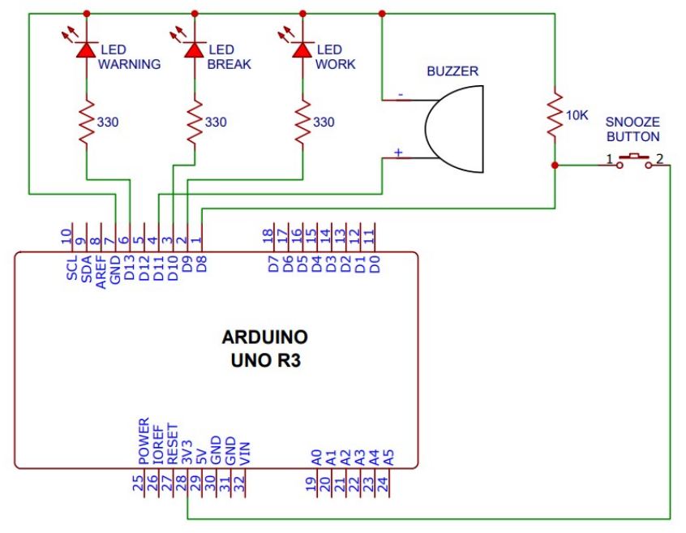

# DeskSpy
DeskSpy is an Arduino-based project which helps the user to take a break every hour, using a OV7670 camera connected to a server via USB that implements facial recognition.
 

  

## Circuit Diagrams

